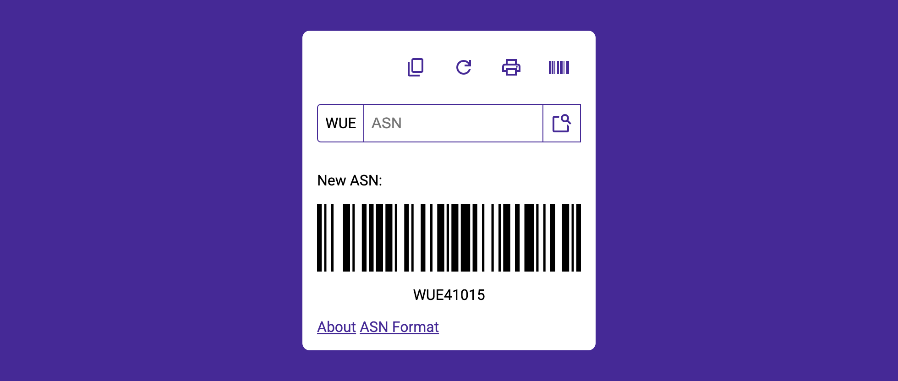

# Deno ASN Generator

[](https://jsr.io/@wuespace)
[](https://jsr.io/@wuespace/asn-generator)
[](https://jsr.io/@wuespace/asn-generator)
[](https://github.com/wuespace/deno-asn-generator/actions/workflows/deno-ci.yml)
[](https://github.com/wuespace/deno-asn-generator/actions/workflows/docker-publish.yml)

[Deployment](DEPLOY.md) · [License (MIT)](./LICENSE) ·
[Contributing](./CONTRIBUTING.md)

---

An environment for collaboratively creating ASN numbers to be used in the
Paperless-NGX based document management system at WüSpace e. V.

<figure>

<figcaption>Screenshot of the Web UI.</figcaption>
</figure>

<figure>

<figcaption>Application Logo.</figcaption>
</figure>

## Core Requirements

- **REQ-1**: The system must be able to generate unique ASN numbers.
- **REQ-2**: The system must be able to be used by multiple users at the same
  time.
- **REQ-3**: The system must allow reserving a range of ASNs for manual
  assignment (e.g., for pre-printed barcodes).
- **REQ-4**: The system must be able to be configured to use a specific prefix
  for the ASN numbers.
- **REQ-5**: The system must be easy to deploy and maintain.

## Concept / ASN Format

> [!NOTE]
> The exact format of the ASN is configurable through environment variables.
> See [ASN_FORMAT_EXAMPLES.md](./ASN_FORMAT_EXAMPLES.md) for a list of examples with different configurations.

```text
WUE  - 100  - 001
(1)  - (2)  - (3)

(1) Prefix specified in configuration (WUE).
(2) Numeric Namespace, whereas
    - 100-599 is reserved for automatic generation, and
    - 600-999 is reserved for user defined namespaces.
    The user defined namespace can be used for pre-printed ASN barcodes and the like.
(3) Counter, starting from 001, incrementing with each new ASN in the namespace.
```

### Calculation of the Namespace

For this example, we'll define $100$ to $599$ as the automatic namespace and
$600$ to $999$ as the user defined namespace. We notate this as

$$ r:=600 $$

Note that the minimum and maximum overall namespace values $r_{min}$ and
$r_{max}$ can be derived as they have to be the minimum and maximum numeric
values with the same number of digits as $r$ to avoid collisions.

Furthermore, let $t$ be the number of milliseconds since the Unix epoch. We can
calculate the current namespace $n$ as follows:

$$ n \in [r_{min}, r]; n = r_{min} + t \mod (r - r_{min}) $$

## Ideas / Roadmap

- [x] Configurability through environment variables
- [x] Log generated ASNs to the file system
- [x] Connection to a database
- [x] REST API
- [x] Visual Web Interface
- [x] CLI
  - [x] Bump counter to avoid collissions after restoring backups (where ASNs
        could have been generated after the time of the backup)
  - [x] Analyze time between ASNs, providing the possibility to specify a
        duration and a maximum collision probability for the bump (e.g. 1 hour,
        0.1%), which calculates the bump counter accordingly
- [x] Documentation
- [x] Publish on JSR
- [ ] Publish on Docker Hub
- [x] Publish on GitHub Container Registry
- [x] UI for quickly searching for ASNs in a DMS
